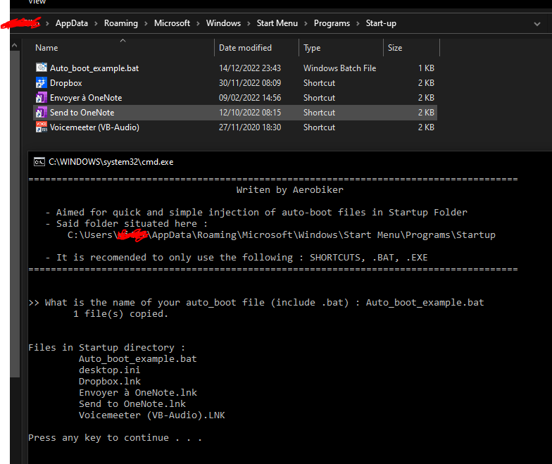
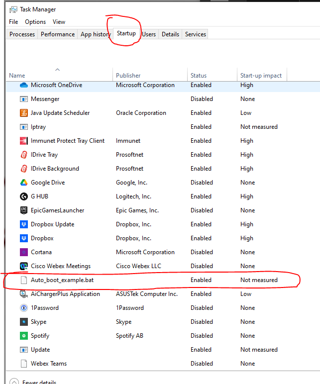

# Simple Windows Bootup File Activation (by user account)
A simple tool that allows people to inject/copy any given file into the Startup directory for windows. This allows that program/shortcut to be executed on boot of the account.

